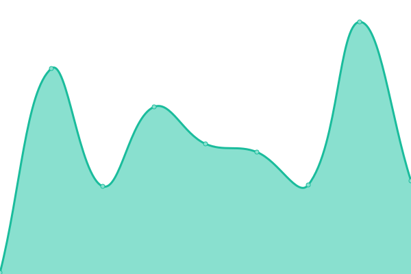
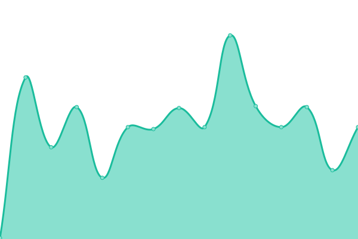

# [📈 Live Status](https://status.voxhost.fr): <!--live status--> **🟩 All systems operational**

This repository contains the open-source uptime monitor and status page for [voxan24](valentinslr.com), powered by [Upptime](https://github.com/upptime/upptime).

With [Upptime](https://upptime.js.org), you can get your own unlimited and free uptime monitor and status page, powered entirely by a GitHub repository. We use [Issues](https://github.com/voxan24/status.voxhost.fr/issues) as incident reports, [Actions](https://github.com/voxan24/status.voxhost.fr/actions) as uptime monitors, and [Pages](https://status.voxhost.fr) for the status page.

<!--start: status pages-->
<!-- This summary is generated by Upptime (https://github.com/upptime/upptime) -->
<!-- Do not edit this manually, your changes will be overwritten -->
<!-- prettier-ignore -->
| URL | Status | History | Response Time | Uptime |
| --- | ------ | ------- | ------------- | ------ |
|  [Voxhost (Main Website)](https://voxhost.fr) | 🟩 Up | [voxhost-main-website.yml](https://github.com/VoXaN24/status.voxhost.fr/commits/HEAD/history/voxhost-main-website.yml) | 

 115ms
     
 | 

<a href="https://status.voxhost.fr/history/voxhost-main-website">100.00%</a>
    

|  [Voxhost (Drive)](https://drive.voxhost.fr) | 🟩 Up | [voxhost-drive.yml](https://github.com/VoXaN24/status.voxhost.fr/commits/HEAD/history/voxhost-drive.yml) | 

 109ms
     
 | 

<a href="https://status.voxhost.fr/history/voxhost-drive">100.00%</a>
    

|  [Voxhost (Pastebin)](https://paste.voxhost.fr) | 🟩 Up | [voxhost-pastebin.yml](https://github.com/VoXaN24/status.voxhost.fr/commits/HEAD/history/voxhost-pastebin.yml) | 

 655ms
     
 | 

<a href="https://status.voxhost.fr/history/voxhost-pastebin">100.00%</a>
    

|  [PCArchive](https://pcarchive.fr) | 🟩 Up | [pc-archive.yml](https://github.com/VoXaN24/status.voxhost.fr/commits/HEAD/history/pc-archive.yml) | 

 137ms
     
 | 

<a href="https://status.voxhost.fr/history/pc-archive">100.00%</a>
    

|  [Personnal Website](https://valentinslr.com) | 🟩 Up | [personnal-website.yml](https://github.com/VoXaN24/status.voxhost.fr/commits/HEAD/history/personnal-website.yml) | 

 632ms
     
 | 

<a href="https://status.voxhost.fr/history/personnal-website">96.42%</a>
    

|  [Blog](https://blog.valentinslr.com) | 🟩 Up | [blog.yml](https://github.com/VoXaN24/status.voxhost.fr/commits/HEAD/history/blog.yml) | 

 1728ms
     
 | 

<a href="https://status.voxhost.fr/history/blog">52.92%</a>
    

|  [ShareX](https://sharex.voxhost.fr) | 🟩 Up | [share-x.yml](https://github.com/VoXaN24/status.voxhost.fr/commits/HEAD/history/share-x.yml) | 

 883ms
     
 | 

<a href="https://status.voxhost.fr/history/share-x">100.00%</a>
    

|  [Speedtest (Ookla)](speedtest.voxhost.fr) | 🟩 Up | [speedtest-ookla.yml](https://github.com/VoXaN24/status.voxhost.fr/commits/HEAD/history/speedtest-ookla.yml) | 

 324ms
     
 | 

<a href="https://status.voxhost.fr/history/speedtest-ookla">100.00%</a>
    

|  [Speedtest (Nperf)](speedtest-nperf.voxhost.fr) | 🟩 Up | [speedtest-nperf.yml](https://github.com/VoXaN24/status.voxhost.fr/commits/HEAD/history/speedtest-nperf.yml) | 

 332ms
     
 | 

<a href="https://status.voxhost.fr/history/speedtest-nperf">100.00%</a>
    

|  [Shorter URL](https://link.voxhost.fr) | 🟩 Up | [shorter-url.yml](https://github.com/VoXaN24/status.voxhost.fr/commits/HEAD/history/shorter-url.yml) | 

 89ms
     
 | 

<a href="https://status.voxhost.fr/history/shorter-url">100.00%</a>
    

<!--end: status pages-->

[**Visit our status website →**](https://status.voxhost.fr)

## 📄 License

- Powered by: [Upptime](https://github.com/upptime/upptime)
- Code: [MIT](./LICENSE) © [voxan24](valentinslr.com)
- Data in the `./history` directory: [Open Database License](https://opendatacommons.org/licenses/odbl/1-0/)
